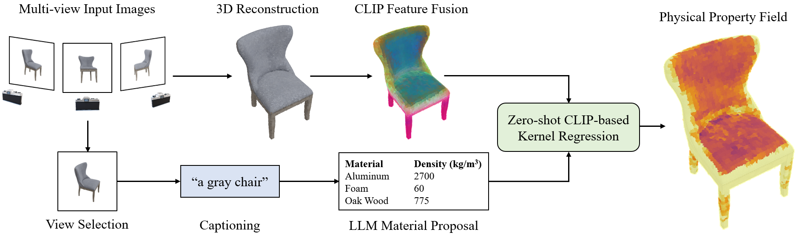

# NeRF2Physics: Physical Property Understanding from Language-Embedded Feature Fields

Albert J. Zhai, Yuan Shen, Emily Y. Chen, Gloria X. Wang, Xinlei Wang, Sheng Wang, Kaiyu Guan, Shenlong Wang<br/>
University of Illinois at Urbana-Champaign

CVPR 2024

Paper link coming soon │ [Project Page](https://ajzhai.github.io/NeRF2Physics/)


**Infer physical properties densely in 3D for any object!**<br/>


## Requirements
### Installing Dependencies
Our method involves 3D reconstruction using [Nerfstudio](https://docs.nerf.studio/). If you want to modify the reconstruction or reproduce it on your own data, you will need to follow the [official instructions to install Nerfstudio](https://docs.nerf.studio/quickstart/installation.html). 

Besides the initial reconstruction, the rest of our method operates on the extracted depth maps/point cloud (which we provide in our dataset) and thus does not require Nerfstudio. So if you don't wish to run Nerfstudio, the only things you need to do are 1) [install PyTorch](https://pytorch.org/get-started/locally/), and 2) run
```
pip install -r requirements.txt
```
to install the remaining dependencies. 

### BLIP-2 Model
Our method uses [BLIP-2-Flan-T5-XL](https://huggingface.co/Salesforce/blip2-flan-t5-xl) for image captioning. To download the model weights, clone the repository into the root directory of this repository (you will need Git LFS). You can also download it elsewhere and specify the location via the `--blip2_model_dir` argument.

### OpenAI API Key
Our method involves calling GPT via the [OpenAI API](https://platform.openai.com/). This requires having an account with some credits on it (usage will be fairly minimal). Once you have an account, find your API key [here](https://platform.openai.com/api-keys) and set a variable named `OPENAI_API_KEY` to your key in a Python file named `my_api_key.py`. Example (replace `<yourkey>` with your API key): 
```
echo "OPENAI_API_KEY = '<yourkey>'" >> ./my_api_key.py
``` 

## ABO-500 Dataset
We provide **ABO-500**, a dataset of multi-view images of objects from [Amazon Berkeley Objects (ABO)](https://amazon-berkeley-objects.s3.amazonaws.com/index.html) with camera parameters and ground-truth object weights. We also provide the intermediate outputs from our method so that you can run any part of our method without needing to run the previous parts. Please download the dataset via [this Box link](https://uofi.box.com/shared/static/743ydh4n1xi0dj05lcyyg4evqk2n4dko.zip) 
and unzip into a directory `data/` (you can also put it elsewhere and specify `--data_dir` later).

Example with curl:
```
curl -L  https://uofi.box.com/shared/static/743ydh4n1xi0dj05lcyyg4evqk2n4dko.zip \
    --output ./abo_500.zip
unzip ./abo_500.zip -d ./data/
```

## Usage
Overview of our method:

We provide separate Python scripts for running each component in our method. Command-line arguments for all of the scripts can be found in `arguments.py`. Intermediate outputs get stored in the scene data directories. If you are using our provided dataset, you can start from anywhere along the pipeline without running the previous components.

### 3D Reconstruction
We use Nerfstudio to train NeRFs and extract depth maps and point clouds. We have wrapped all of the Nerfstudio commands into `ns_reconstruction.py`. Example (only processes one scene):
```
python ns_reconstruction.py --end_idx 1
```
This is the only step that requires Nerfstudio.


### CLIP Feature Fusion
Feature fusion is done in `feature_fusion.py`. Example (only processes one scene):
```
python feature_fusion.py --end_idx 1
```

### Captioning and View Selection
Captioning and view selection are both done in `captioning.py`. Example (only processes one scene):
```
python captioning.py --end_idx 1
``` 
This requires downloading the BLIP-2 model (see Requirements above). 


### LLM Material Proposal
Material proposal is done in `material_proposal.py`. You can specify the physical property of interest using the `--property_name` argument. Currently, only mass density, friction, and Shore hardness are supported, but feel free to make prompts for other properties (see `gpt_inference.py`). Example (only processes one scene):
```
python material_proposal.py --property_name density --end_idx 1
``` 
This requires setting your OpenAI API Key (see Requirements above).

### CLIP-based Kernel Regression (Final Prediction)
Physical properties are predicted using CLIP-based kernel regression in `predict_property.py`. Example (only processes one scene):
```
python material_proposal.py --property_name density --end_idx 1
``` 
By default, the script will predict a volume integral of the physical property (e.g. predicting mass by integrating density). You can instead get dense results for a 3D grid of points by setting `--prediction_mode` to `grid`. You can also write your own code using the `predict_physical_property_query` function to query points however you want.

### Evaluation
We provide a script for quantitative evaluation of mass predictions in `evaluation.py`. The results will be printed in your terminal. Example:
```
python evaluation.py
``` 
Explanations of each metric can be found in our paper.

### Visualization
We provide a script for interactively viewing and saving 3D visualizations in `visualization.py`. You should specify the scene name using the `--scene_name` argument. Example:
```
python visualization.py --scene_name B075YQXRBS_ATVPDKIKX0DER
```

## Using Custom Data
To run our method on your own data, you can use [Nerfstudio's data processing tool](https://docs.nerf.studio/quickstart/custom_dataset.html) to convert your data into the right format. You can then run the components of our method in order.


## Citation
Please cite our paper if you find this repo useful!
```bibtex
@inproceedings{zhai2024physical,
  title={Physical Property Understanding from Language-Embedded Feature Fields},
  author={Zhai, Albert J and Shen, Yuan and Chen, Emily Y and Wang, Gloria X and Wang, Xinlei and Wang, Sheng and Guan, Kaiyu and Wang, Shenlong},
  booktitle={CVPR},
  year={2024}
}
```